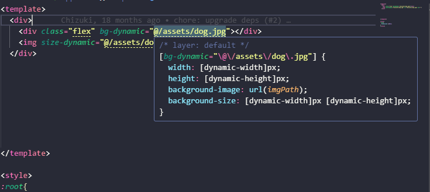
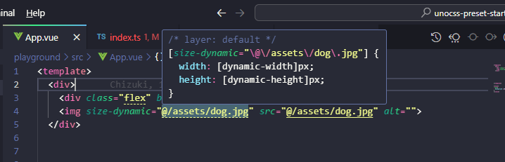

# unocss-preset-starter [](https://www.npmjs.com/package/unocss-preset-dynamic)

根据图片路径自动生成宽高和background-size

## Features
- 🔥 根据图片路径动态生成width和heigth
- 🔥 结合presetAttributify获得良好的智能提示


## Usage
```shell
npm i -D unocss-preset-dynamic
```

```ts
// uno.config.ts
import { defineConfig, presetAttributify } from 'unocss'
import { presetDynamic } from 'unocss-preset-dynamic'
import { aliases } from './playground/vite.config'
import { fileURLToPath } from 'url'
import path from 'path'

const __filename = fileURLToPath(import.meta.url);
const __dirname = path.dirname(__filename);

export default defineConfig({
  presets: [
    // @ts-ignore
    presetDynamic({
      // 为了识别vite中配置的别名
      // 最好传入该属性
      alias: {
        '@': path.resolve(__dirname, 'src')
      }
    }),
    presetAttributify()
  ],
})
```

检查是否配置了tsconfig.json(jsconfig.json)

```json
// tsconfig.json 
// or jsconfig.json
{
  "compilerOptions": {
    "baseUrl": ".",
    "paths": {
      "@/*": ["src/*"]
    }
  },
  "include": ["src/**/*.ts", "src/**/*.tsx", "src/**/*.vue"]
}
```

添加类型扩展文件
在src下新建global.d.ts

```ts
import type { AttributifyAttributes } from '@unocss/preset-attributify'
import type { DynamicAttributes } from 'unocss-preset-dynamic'

declare module '@vue/runtime-dom' {
  interface HTMLAttributes extends AttributifyAttributes, DynamicAttributes {
    // other
  }
}
```

- bg-dynamic 预览



- size-dynamic 预览




## License

[MIT](./LICENSE) License © 2023 [pangxie231](https://github.com/pangxie231)
